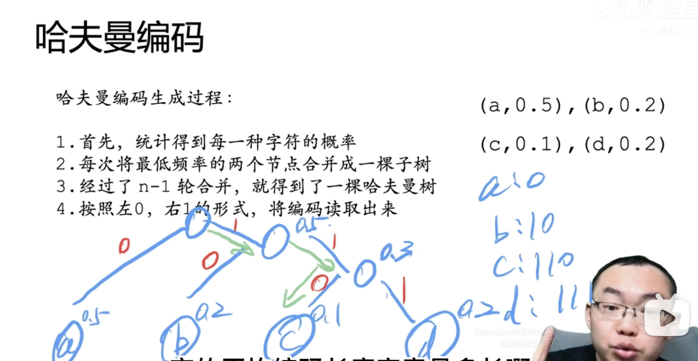

# 哈夫曼编码

---
> 编码(信息从一种形式或格式转换为另一种形式的过程)
  - 定长编码
    - 字节(Byte)是用来衡量计算机存储容量的单位。它还表示计算机编程语言中的数据类型和语言字符。
    - 计算机是二进制的，1个比特位只可以表示为0或者1这两种数，那8个比特（一般从右至左）就可以有0～127（2的8次方再减1）的不同的数值表示。
    - C语言ASCII码中，1个字节等于8位比特位(Bit)。
    - JavaScript 基本数据类型在计算机占的内存是8个字节
    - char是1个字节，汉字是2个字节，int是4个字节，double是8个字节
    - 1024字节=1KB，1024KB=1MB，1024MB=1GB，1024GB=1TB
  - 变长编码
    - 自定义1个字节占多少比特位

---
> 衡量两套编码的优劣
  - 平均编码长度
    - count(s[n]编码长度 * s[n]出现概率)

---
> 哈夫曼编码(最优变长编码)
  - 
  - 注意: 
    - 任何两个字符的编码，不能形成前缀关系。
    - 例: a编码为1、b编码为10、c编码为0。对编码110进行解码会有两种组合: ab、aac。此时不能解码出正确的编码
